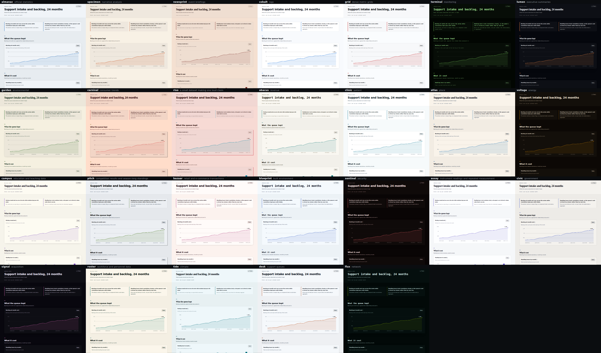

# canvas-report

A skill that turns a dataset into **one self-contained HTML file a reader can explore** — every
chart drawn directly on `<canvas>`, no libraries fetched, no network requests at all.

It also refuses to make the same report twice.



*The same demo data and the same runtime, under all ten themes.*

---

## Why

Most report generators are accurate and forgettable. They produce a hero figure, three cards, a
chart grid and a footer, forever, regardless of what the data is. The analysis may be sound, but
nobody reads the second one.

So this skill makes two decisions before it makes a chart:

1. **Pick the page shape from the data** — one of ten macrostructures, chosen because the data
   supports it, not because it was the default.
2. **Rotate the look** — theme and masthead must differ from the previous report on recorded axes.

The analytical discipline is not traded away for it. Every chart still owes the reader a table
twin, a help tooltip and a methodology section that says what the data cannot do.

## What you get

**A single `.html` file.** Data embedded as JSON, charts drawn on canvas, zero external requests.
It works offline, it survives being emailed, and it renders the same in five years.

- **15 chart factories** — `line` `columns` `divColumns` `hbars` `divHbars` `panels` `bubbles`
  `waterfall` `spark` `donut` `heatmap` `slope` `lollipop` `boxplot` `stackedArea`
- **10 themes** × day/night drops, generated to a contrast contract
- **10 macrostructures** — Briefing · Ledger · Scrollytelling · Workbench · Broadsheet ·
  Poster/Almanac · Deck · Bridge · Comparison spread · Field notes
- **Archetypes** for masthead, section head, insight, chart card, filter bar and methodology
- Hover tooltips, keyboard-and-touch help tooltips, sortable table twins, a light/dark toggle,
  and motion that always finishes

## Install

```bash
# personal, available in every project
git clone https://github.com/<you>/canvas-report ~/.claude/skills/canvas-report

# or per project
git clone https://github.com/<you>/canvas-report .claude/skills/canvas-report
```

## Try it without installing anything

`assets/report-shell.html` is a finished runtime, not a template. Open it in a browser and a demo
report runs — every chart type, both themes, tooltips and table twins working.

```bash
python3 assets/apply-theme.py --list                                  # the ten themes
python3 assets/apply-theme.py assets/report-shell.html newsprint      # swap one in
```

## Using it

Point it at data and ask. The trigger phrasing is ordinary: *"make me a report"*, *"dashboard"*,
*"visualise this analysis"*, *"interactive report"*, *"make it look different this time"*.

```
Build a report from data/july-billing.csv
Make a report from this query, workbench style, and put it in ./out
Same data, different face — the last one was a broadsheet
```

**Give it the data, not a description of the data.** A path, a query, a table it can run. The
first step of the procedure is to profile what it was actually given: column types, null rates,
the time grain, how many distinct values each key has, whether two periods can be compared. A
lens the shape cannot carry is dropped rather than faked, so guessing at this step poisons
everything after it.

### What happens, in order

| Step | What it does | Where it is written down |
|---|---|---|
| 0–1 | profile the data, then fix four to six falsifiable sentences | `references/analysis-lenses.md` |
| 2 | read `.canvas-report/log.json` for the last few reports | — |
| 3–4 | pick a macrostructure, then a theme and masthead that all differ | `references/macrostructures.md`, `themes.md` |
| 5 | copy the shell, apply the theme, write the wiring | `assets/`, `references/pitfalls.md` |
| 6–8 | sections, motion, help tooltips, methodology | `motion.md`, `tooltip-help.md` |
| 9–10 | render at three widths, then score 42 gates | `references/slop-test.md` |

### Steering it

You do not have to. But these all work, and the skill will say so on the page if you override it:

- **A shape** — *"as a deck"*, *"workbench with filters"*, *"scrollytelling"*. It will still refuse
  a shape the data cannot carry (a three-step scrollytelling piece is an empty scroll).
- **A theme** — *"use the dark one"*, *"newsprint"*. Rotation still applies to the next report.
- **A language** — the shell ships English; ask for another and it translates the one
  `[L] CR_STRINGS` block and sets `<html lang>` so numbers format correctly.
- **An edit** — *"change the third chart"* keeps the existing macro and theme. Rotation is for new
  reports, not revisions.

### Where things land

```
<subject>-<period>.html        the report. One file, open it anywhere
.canvas-report/log.json        the rotation log — what shape and theme the last reports used
```

`.canvas-report/` is gitignored here, because it is state rather than source. Keep it next to your
reports; without it the skill cannot tell what it already used, and every report starts looking
the same again.

### Reading the stamp

Every report opens with a comment recording how it was made. It is meant to be read.

```
canvas-report · macro: 02 Ledger · theme: grid · masthead: M4 · lenses: index, trend, comparison
read:
  analysis-lenses "Below about five values per group"
                    -> 31 values per hour, well over the floor, so a boxplot is honest
  motion          "| redraw after a filter change | **0ms** | a control must respond instantly |"
                    -> the tab switch repaints instead of playing
  ...
critique: P5 H5 E5 S5 R5 V5 D5
```

The `read:` block is a **quote block, not a checklist**: one verbatim fragment per reference file
that was open while building, and the decision that fragment drove. A file name alone can be
written from memory; a quotation cannot. Check one yourself:

```bash
grep -Fq 'Below about five values per group' references/analysis-lenses.md && echo real
```

If a quote does not match its file, the report claims a gate it never read.

### Verifying a report yourself

The skill treats this as mandatory, and you can repeat it:

```bash
# render at the three widths, with motion disabled so you do not catch a mid-animation frame
for w in 1240 768 500; do
  google-chrome --headless=new --force-prefers-reduced-motion \
    --window-size=$w,4000 --screenshot=out-$w.png "file:///abs/path/report.html"
done
```

Then look for the failures a screenshot shows and a validator does not: colliding labels, marks
outside the plot, clipped text, blank canvases, an `N rows omitted` note you did not expect.
Judge horizontal overflow by measuring `document.documentElement.scrollWidth` against
`innerWidth` — not by looking, since headless clamps the viewport to 500px.

That run deliberately turns motion off, so it cannot tell you whether the charts move — and
neither can leaving the flag out, because `--virtual-time-budget` freezes
`requestAnimationFrame` and every frame then reads the same value. Motion has its own check, on
a real clock:

```bash
python3 assets/check-motion.py report.html   # needs the `websockets` package
```

It drives Chrome over the DevTools protocol, scrolls the page the way a reader would, and prints
one line per chart: whether anything played it on entry, how many distinct frames it drew, and
whether it landed on its final state. It exits non-zero if a chart never moves.

The stamp has a checker too. Every quote in the `read:` block must still appear verbatim in the
file it cites, which catches both an invented quote and a reference edited after the fact:

```bash
python3 assets/check-quotes.py report.html
```

## The rules it will not break

These are enforced, not suggested:

- **No dual axes.** Two metrics in different units never share a chart.
- **The axis range comes from the data**, never back-computed from the tick list.
- **Colour is used by role** — identity, magnitude, direction. No rainbows, no hex on the canvas.
- **Every chart owes a table twin.** A tooltip supplements; it is never the only route.
- **No invented numbers.** A metric you did not supply becomes `—`, or the section is dropped.
- **Nothing is dropped silently.** Rows that cannot be plotted are counted on the canvas.
- **The animation always ends**, even if the browser stops rendering. The final frame holds all
  the information, and movement is confined to four places that carry meaning.
- **The limits section is mandatory** — including what the data cannot see.

A finished report is scored against 42 gates in `references/slop-test.md` before it ships.
If anything in the data-honesty group trips, the rest of the score is void.

## Layout

```
SKILL.md                     the procedure: profile → insights → shape → theme → wire → verify
assets/
  report-shell.html          the runtime. Open it; a demo runs
  themes.css                 10 themes × day/night, hex-frozen from OKLCH
  apply-theme.py             swaps a theme without breaking the shell's marks
references/
  analysis-lenses.md         data shape → lens → chart
  macrostructures.md         index; read one file from macrostructures/
  themes.md                  catalogue, rotation rule, contrast contract
  components.md              masthead / section head / insight / card archetypes
  motion.md                  the four places movement is allowed, and its bounds
  tooltip-help.md            help copy and the accessibility contract
  anti-patterns.md           read while generating
  pitfalls.md                read before touching the runtime
  slop-test.md               read only when it is built
  external-tools.md          D3, Plotly, GSAP, Motion, anime.js, Lottie, Rive —
                             what to borrow from each and what to refuse
lab/motion-engines/          worked examples for when the answer is "use the real tool":
                             six runnable pages, one per runtime, vendored and SHA-pinned.
                             Deliberately outside the output contract — not reports
docs/themes.png              the contact sheet above
```

## Requirements

- A modern browser for the report itself (OKLCH is only used at authoring time; shipped tokens
  are hex, so the output is broadly compatible).
- Python 3 for `apply-theme.py` — standard library only.
- Headless Chrome if you want the verification step, which the skill treats as mandatory:

```bash
google-chrome --headless=new --force-prefers-reduced-motion \
  --window-size=1240,8000 --screenshot=out.png "file:///absolute/path.html"
```

`--force-prefers-reduced-motion` is required — without it you capture a mid-animation frame and
misdiagnose it as a broken chart.

## Localisation

The shell ships in English. Every string a reader sees lives in one `[L] CR_STRINGS` block —
translate that, not the code, and set `<html lang="…">` so `Intl` formats numbers and magnitudes
for the locale.

Theme font stacks name Latin faces and then fall through to `system-ui` / `ui-serif` /
`ui-monospace`, so any script the named faces do not cover is resolved by the operating system.
Note the consequence: in a non-Latin report the difference between themes is carried by spacing,
scale, rules and colour rather than by the typeface, which is exactly why the macrostructure
matters more than the theme.

## Attribution

Merged from two predecessors:

- **canvas-data-report** — the canvas runtime, the analysis lenses, table twins, help tooltips
  and the methodology discipline.
- **[Hallmark](https://www.usehallmark.com) (MIT)** — macrostructure-first selection, three-axis theme
  rotation, component archetypes and the anti-slop gates. The theme palettes here were derived
  from Hallmark's OKLCH token values and recomputed against a contrast contract.

Hallmark is MIT licensed; its copyright notice is reproduced in full in [`NOTICE`](NOTICE), which
must travel with any redistribution of this repository.

## Licence

MIT — see [`LICENSE`](LICENSE). Third-party notices are in [`NOTICE`](NOTICE).
