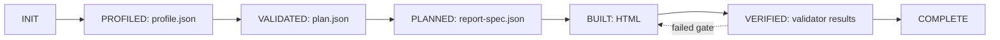

# canvas-report

[](https://github.com/seohyunjun/canvas-report/releases)
[](LICENSE)


`canvas-report` turns supplied data into a visually authored report system. It keeps tool roles
explicit: D3 and Plotly inform chart form and state, while GSAP, Motion, or anime.js supplies chart
motion. The canonical deliverable remains one self-contained interactive HTML analysis report. Charts draw
on `<canvas>`, data is embedded, table twins and help are available to readers, and no external
scripts, images, or fonts are fetched.

It is an artifact pipeline, not a prompt-to-HTML shortcut: profile evidence constrains the plan, a compiler validates the plan, a deterministic builder owns HTML, and progressive validators decide whether the report ships.


## Install

This repository is both a Claude Code plugin and the marketplace that lists it.

```shell
/plugin marketplace add seohyunjun/canvas-report
/plugin install canvas-report@seohyunjun
```

The skill then runs as `/canvas-report:canvas-report`, and Claude invokes it on its own when a
request calls for a report. Claude Code v2.1.142 or later is required: the plugin has no `skills/`
directory, so the root `SKILL.md` is loaded as the single skill it declares.

Installing copies the whole directory, `lab/` included — `references/external-tools.md` links into
it for the motion-engine worked examples. To follow a branch instead of the default one, add the
marketplace with a ref:

```shell
/plugin marketplace add seohyunjun/canvas-report@<branch-or-tag>
```

Without the plugin, the skill also works as a plain directory: clone the repository somewhere
Claude can read and point it at `SKILL.md`.

## Contract

A run defaults to:

```text
<output-dir>/.canvas-report/runs/<run-id>/
```

All artifacts use `schema_version: "1.0"`. The state path is:

```text
INIT → PROFILED → VALIDATED → PLANNED → BUILT → VERIFIED → COMPLETE
```



| State | Input | Output | Complete when |
|---|---|---|---|
| INIT | data source, requirements, output directory | run manifest | the run is identified |
| PROFILED | source data | `profile.json` | data shape and quality are evidenced |
| VALIDATED | profile, requirements, rotation history | Agent-written `plan.json` | the plan is schema-valid and compatible |
| PLANNED | profile, plan, `schemas/*.schema.json`, `references/rules.json`, `references/index.json` | `report-spec.json` | plan rules compile without errors |
| BUILT | spec and read-only runtime assets | builder-owned HTML | offline report contract is emitted |
| VERIFIED | HTML and declared validation inputs | structured results | required progressive gates pass |
| COMPLETE | verified artifacts | final report/run record | no unresolved error diagnostics remain |

Changing an upstream artifact invalidates all downstream artifacts. Validators report but never repair. Diagnostics have this stable shape:

```json
{"severity":"error","id":"ZERO-NETWORK-001","location":"sections[1]","problem":"...","suggested_fix":"..."}
```

## Ownership

| Writer | Owns |
|---|---|
| Agent | `plan.json` only |
| `assets/profile-data.py` | `profile.json` |
| `assets/validate-plan.py` | validated `report-spec.json` |
| `assets/build-report.py` | generated HTML |
| `assets/report-state.py` | hash-bound `run.json` |
| `assets/validate-report.py` | `validation.json` |

The runtime shell, resize/layout code, tooltip system, `VIZ` factories, and motion engines are read-only to report runs. Agents do not get runtime-edit permission; generated HTML is builder-owned.

## Build flow

1. Run `assets/profile-data.py` on actual data. The profile covers types, nulls and sentinels, measures/dimensions, cardinality, time grain, candidate-key checks, and comparable periods.
2. Draft evidence-driven, falsifiable insights — **typically 2–6**, not a fixed quota. Unsupported claims and lenses are dropped or rewritten.
3. Run `assets/select-candidates.py`, which scores every theme against the dataset's own subject
   as well as filtering for compatibility. Then use `references/external-tools.md` to select one
   chart/state source and at most one primary motion source, and
   `references/motion-features.md` to choose the easing and duration each chart factory wants.
   The Agent writes only `plan.json`: insights, creative direction, external-tool strategy,
   supported charts, macrostructure, theme and its `theme_rationale`, masthead,
   table/help/methodology requirements, and per-chart motion contracts.
4. Run `assets/validate-plan.py` against `schemas/*.schema.json`, `references/rules.json`, and `references/index.json`. It emits `report-spec.json` only for a compatible plan.
5. Run `assets/build-report.py`; it deterministically produces one offline HTML file.
6. Run `assets/validate-report.py` to persist progressive build, render, and declared-motion gates in `validation.json`.

Use at most four repairs for a failed requirement: **Local Fix → Component Rebuild → Simplify → Drop Unsupported Section**. Every repair invalidates affected downstream artifacts and reruns their gates. Never hand-edit generated HTML or bypass a gate.
`assets/report-state.py retry` records the attempt, invalidates downstream hashes, and rejects a fifth repair.

## Requirements and conflicts

User requirements take priority over rotation **only after compatibility** with the profile and report contract is proved. Incompatible requested charts, macrostructures, or motion yield a structured diagnostic and an evidence-based alternative.

Theme selection runs three passes in order: **compatibility, subject fit, then rotation.**
`references/themes.json` catalogues twenty-six themes with the subjects each suits, and
`assets/select-candidates.py` scores every compatible theme against the profiled column names, the
source file name, and the stated requirements — a billing extract reaches for `abacus`, an incident
feed for `sentinel`, a climate series for `tide`. The selected theme must then be rotation distance
**at least 2** from the previous theme, unless the user explicitly requests a compatible override;
record that override in the plan. Fit outranks distance.

The plan records the decision in `theme_rationale` — subject, signals, and the `fit_score` and
`rotation_distance` copied from the candidate artifact — and `assets/validate-plan.py` checks that
record against the artifact, so a plan cannot claim a subject match the profile does not evidence.
Macrostructure and masthead rotate when compatible alternatives exist.

The builder compiles **twenty-one chart types**, one for each lens in
`references/analysis-lenses.md`: `line`, `columns`, `divColumns`, `histogram`, `hbars`, `bullet`,
`lollipop`, `divHbars`, `waterfall`, `panels`, `slope`, `dumbbell`, `boxplot`, `interval`,
`bubbles`, `scatter`, `heatmap`, `stackedArea`, `donut`, `concentration` and `spark`. A chart names
its `type` and maps the roles that type reads to profiled columns, and the validator checks every
role against the profile: a role the type does not read, a category in a measure role, a negative
value under a chart that reads magnitude as a share or an area, and a row count outside what the
factory will draw are each a diagnostic rather than a chart that quietly draws nothing. `columns`,
`stackedArea` and `panels` take two or three series through `value`, `value2` and `value3` — there
is no fourth, because the colour contract will not invent one — and the builder emits the legend
that names them by column.

A chart may also carry `options`, a per-type set of factory capabilities the runtime always had and
no plan could reach: the reference line on `interval`, axis names and an identity line on `scatter`
and `bubbles`, the diverging mode on `divColumns`, a bin override on `histogram`, called-out marks
on `concentration`, opening and closing labels on `waterfall`, a centre label on `donut`. An option
the type does not read, or a value outside what the factory draws, is a diagnostic.

The report never fetches external fonts. It uses the shipped system-font stacks. Bars always use a zero baseline. There are no dual axes; axes derive from data; every chart has a table twin and accessible help; and basis, formulas, and limits stay visible.

Motion is designed first as one report-level reading sequence and then made explicit **per chart**.
The deterministic builder supports restrained `entry` motion triggered once on view, with a
declared duration and value-safe easing. Prefer it for eligible evidence charts; keep a chart
static when a chart-specific clarity reason warrants it. Filters redraw immediately, reduced
motion omits animation, and the final state contains all information.

`references/motion-features.md` catalogues every feature the [Motion quick-start](https://motion.dev/docs/quick-start)
and the [anime.js vanilla-JS guide](https://animejs.com/documentation/getting-started/using-with-vanilla-js)
advertise — `animate` in both forms, keyframes, `stagger`, springs, `scroll`, `inView`, gestures,
timelines, draggables, the SVG and text toolsets — against the **pinned** 11.11.17 and 3.2.2 files,
and marks each one used, supplied by the shell, held, absent, or refused. It then routes the choice:
a reveal chart (`line`, `concentration`) takes a steady curve at 600–800 ms, a value-scaled mark
(`columns`, `hbars`, `lollipop`) one that arrives early at 400–600 ms, and `bubbles` 700–900 ms
because radius is the square root of area. `MOTION-FIT-001`/`-002` warn outside those bands, and
`MOTION-PORTABLE-CEILING-001` is an error when a portable-pattern chart declares more than the
900 ms the shell actually runs.

## Rule provenance and lazy references

`references/rules.json` and `references/index.json` provide authoritative Rule-ID provenance. Profile, plan, spec, and validator artifacts identify the rules they applied. Quotations may be retained as explanatory notes but are optional and non-authoritative; quote stamps are not validation evidence.

Reference loading is lazy:

- **Core:** `references/rules.json`, `references/themes.json`, `references/analysis-lenses.md`, and `references/anti-patterns.md`.
- **Conditional:** `uncertainty.md` for comparisons/estimates, the selected macrostructure,
  `themes.md`, `components.md`, `tooltip-help.md`, factory-relevant `pitfalls.md`, selected tool and
  lab sections from `external-tools.md`, `motion.md` whenever charts exist, and
  `motion-features.md` before any motion contract is written.
- **Final:** `references/slop-test.md` and validator guidance after a build exists.

## Layout

```text
.claude-plugin/          plugin manifest and marketplace catalogue
SKILL.md                 state-machine guidance and ownership
assets/profile-data.py   deterministic profile → profile.json
assets/select-candidates.py compatible lens/macro/theme candidates
assets/validate-plan.py  rules compiler → report-spec.json
assets/build-report.py   deterministic builder → HTML
assets/report-state.py   ordered state transitions and artifact hashes
assets/validate-report.py progressive gates → validation.json
assets/check-render.py   render/layout gate
assets/check-motion.py   declared-motion gate
assets/check-themes.py   theme contrast contract and catalogue agreement
assets/make-themes.py    design rows → generated theme blocks
assets/theme-sheet.py    docs/themes.png contact sheet
schemas/*.schema.json    artifact contracts
references/rules.json,
references/index.json    authoritative Rule-ID provenance
references/themes.json   theme catalogue: axes, subject keywords, fit baselines
assets/report-shell.html read-only report runtime
references/              analytical, design, and final-review guidance
```

## Report principles

- Use actual supplied data; never invent a metric or comparison.
- Select only lenses the profile supports; disclose exclusions and uncertainty.
- Keep charts inspectable through table twins, accessible help, and methodology.
- Use colour semantically, never as decoration.
- Preserve an offline, reproducible artifact trail from profile through validation.

For a single chart, use a chart factory without this report pipeline. For no data, request data rather than generate a mock report.
