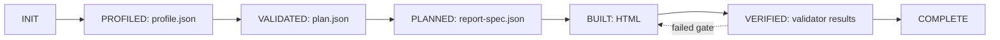

# canvas-report

[](https://github.com/seohyunjun/canvas-report/releases)
[](LICENSE)


`canvas-report` turns supplied data into one self-contained interactive HTML analysis report. Charts draw on `<canvas>`, data is embedded, table twins and help are available to readers, and no external scripts, images, or fonts are fetched.

It is an artifact pipeline, not a prompt-to-HTML shortcut: profile evidence constrains the plan, a compiler validates the plan, a deterministic builder owns HTML, and progressive validators decide whether the report ships.


## Contract

A run defaults to:

```text
<output-dir>/.canvas-report/runs/<run-id>/
```

All artifacts use `schema_version: "1.0"`. The state path is:

```text
INIT → PROFILED → VALIDATED → PLANNED → BUILT → VERIFIED → COMPLETE
```



| State | Input | Output | Complete when |
|---|---|---|---|
| INIT | data source, requirements, output directory | run manifest | the run is identified |
| PROFILED | source data | `profile.json` | data shape and quality are evidenced |
| VALIDATED | profile, requirements, rotation history | Agent-written `plan.json` | the plan is schema-valid and compatible |
| PLANNED | profile, plan, `schemas/*.schema.json`, `references/rules.json`, `references/index.json` | `report-spec.json` | plan rules compile without errors |
| BUILT | spec and read-only runtime assets | builder-owned HTML | offline report contract is emitted |
| VERIFIED | HTML and declared validation inputs | structured results | required progressive gates pass |
| COMPLETE | verified artifacts | final report/run record | no unresolved error diagnostics remain |

Changing an upstream artifact invalidates all downstream artifacts. Validators report but never repair. Diagnostics have this stable shape:

```json
{"severity":"error","id":"ZERO-NETWORK-001","location":"sections[1]","problem":"...","suggested_fix":"..."}
```

## Ownership

| Writer | Owns |
|---|---|
| Agent | `plan.json` only |
| `assets/profile-data.py` | `profile.json` |
| `assets/validate-plan.py` | validated `report-spec.json` |
| `assets/build-report.py` | generated HTML |
| `assets/report-state.py` | hash-bound `run.json` |
| `assets/validate-report.py` | `validation.json` |

The runtime shell, resize/layout code, tooltip system, `VIZ` factories, and motion engines are read-only to report runs. Agents do not get runtime-edit permission; generated HTML is builder-owned.

## Build flow

1. Run `assets/profile-data.py` on actual data. The profile covers types, nulls and sentinels, measures/dimensions, cardinality, time grain, candidate-key checks, and comparable periods.
2. Draft evidence-driven, falsifiable insights — **typically 2–6**, not a fixed quota. Unsupported claims and lenses are dropped or rewritten.
3. Run `assets/select-candidates.py`, then the Agent writes only `plan.json`: insights, supported charts, macrostructure, theme, masthead, table/help/methodology requirements, and per-chart motion decisions.
4. Run `assets/validate-plan.py` against `schemas/*.schema.json`, `references/rules.json`, and `references/index.json`. It emits `report-spec.json` only for a compatible plan.
5. Run `assets/build-report.py`; it deterministically produces one offline HTML file.
6. Run `assets/validate-report.py` to persist progressive build, render, and declared-motion gates in `validation.json`.

Use at most four repairs for a failed requirement: **Local Fix → Component Rebuild → Simplify → Drop Unsupported Section**. Every repair invalidates affected downstream artifacts and reruns their gates. Never hand-edit generated HTML or bypass a gate.
`assets/report-state.py retry` records the attempt, invalidates downstream hashes, and rejects a fifth repair.

## Requirements and conflicts

User requirements take priority over rotation **only after compatibility** with the profile and report contract is proved. Incompatible requested charts, macrostructures, or motion yield a structured diagnostic and an evidence-based alternative.

Theme selection first filters to compatible choices. The selected theme must be rotation distance **at least 2** from the previous theme, unless the user explicitly requests a compatible override; record that override in the plan. Macrostructure and masthead rotate when compatible alternatives exist.

The report never fetches external fonts. It uses the shipped system-font stacks. Bars always use a zero baseline. There are no dual axes; axes derive from data; every chart has a table twin and accessible help; and basis, formulas, and limits stay visible.

Motion is optional and explicit **per chart**. Use it only when it conveys a waterfall flow, scrollytelling transition, keyed re-sort, or deliberate one-time entry reading aid. Static charts are valid. Filters redraw immediately, reduced motion omits animation, and the final state contains all information.

## Rule provenance and lazy references

`references/rules.json` and `references/index.json` provide authoritative Rule-ID provenance. Profile, plan, spec, and validator artifacts identify the rules they applied. Quotations may be retained as explanatory notes but are optional and non-authoritative; quote stamps are not validation evidence.

Reference loading is lazy:

- **Core:** `references/rules.json`, `references/analysis-lenses.md`, and `references/anti-patterns.md`.
- **Conditional:** `uncertainty.md` for comparisons/estimates, the selected macrostructure, `themes.md`, `components.md`, `tooltip-help.md`, factory-relevant `pitfalls.md`, `motion.md` when enabled, and relevant `external-tools.md` sections.
- **Final:** `references/slop-test.md` and validator guidance after a build exists.

## Layout

```text
SKILL.md                 state-machine guidance and ownership
assets/profile-data.py   deterministic profile → profile.json
assets/select-candidates.py compatible lens/macro/theme candidates
assets/validate-plan.py  rules compiler → report-spec.json
assets/build-report.py   deterministic builder → HTML
assets/report-state.py   ordered state transitions and artifact hashes
assets/validate-report.py progressive gates → validation.json
assets/check-render.py   render/layout gate
assets/check-motion.py   declared-motion gate
schemas/*.schema.json    artifact contracts
references/rules.json,
references/index.json    authoritative Rule-ID provenance
assets/report-shell.html read-only report runtime
references/              analytical, design, and final-review guidance
```

## Report principles

- Use actual supplied data; never invent a metric or comparison.
- Select only lenses the profile supports; disclose exclusions and uncertainty.
- Keep charts inspectable through table twins, accessible help, and methodology.
- Use colour semantically, never as decoration.
- Preserve an offline, reproducible artifact trail from profile through validation.

For a single chart, use a chart factory without this report pipeline. For no data, request data rather than generate a mock report.
