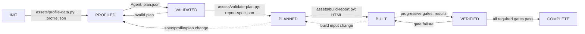

# Canvas Report

Turn supplied data into a visually authored report system. Use `references/external-tools.md` to
select the smallest effective chart and motion toolchain, then ship one self-contained HTML report
with canvas charts, table twins, help tooltips, methodology, and no network requests. Analytical
honesty and a distinct visual face are both requirements; visual ambition never justifies an
unsupported claim.

## Artifact ownership and run state

A run defaults to `<output-dir>/.canvas-report/runs/<run-id>/` and uses `schema_version: "1.0"`.

| Owner | Writes | May not write |
|---|---|---|
| Agent | `plan.json` only | profile, spec, HTML, validator results, or runtime engines |
| `assets/profile-data.py` | `profile.json` | plan, spec, HTML |
| `assets/validate-plan.py` | validated `report-spec.json` | profile, HTML |
| `assets/build-report.py` | builder-owned `.html` | plan, profile, spec |
| `assets/report-state.py` | hash-bound `run.json` | report artifacts |
| progressive validators | `validation.json` and diagnostics | source artifacts or HTML |

The runtime shell, resize/layout code, tooltip system, `VIZ` factories, and motion engines are **read-only to report runs**. Do not grant runtime-edit permission to an Agent. The builder owns generated HTML; report prose and choices arrive through the validated spec, not hand edits.

Diagnostics always use:

```json
{"severity":"error","id":"MOTION-INTENT-001","location":"plan.sections[1]","problem":"...","suggested_fix":"..."}
```

A diagnostic `id` is a Rule ID in the registry's own format: uppercase segments and a
three-digit number, `AREA-001` or `AREA-DETAIL-001`. `schemas/diagnostic.schema.json` enforces
it. An ID that names a rule in `references/rules.json` — `ZERO-NETWORK-001`, `RESPONSIVE-001`,
`MOTION-FINAL-STATE-001` — reports that registry rule wherever it is detected; the rest are
validator codes in the same shape, and the `problem` field carries the specifics.

## State machine



The labels mean: `VALIDATED` is the state in which a submitted `plan.json` has passed structural validation; `PLANNED` requires the compiler's validated `report-spec.json`. State is recorded with artifact hashes. A changed upstream artifact invalidates every downstream state and result. A user change invalidates from the earliest affected input. Validators never repair artifacts.

| State | Exact input | Output | Completion criteria |
|---|---|---|---|
| INIT | data source, user requirements, output directory | `run.json` from `assets/report-state.py init` | input hash is recorded; run directory exists |
| PROFILED | source data | `profile.json` from `assets/profile-data.py` | types, null/sentinel handling, cardinality, time grain, measures, candidate-key checks, and comparable periods are evidenced |
| VALIDATED | `profile.json`, requirements, rotation history | Agent-written `plan.json` | plan is schema-valid and each requested choice is compatible with profile evidence |
| PLANNED | `profile.json`, `plan.json`, `schemas/*.schema.json`, `references/rules.json`, `references/index.json` | `report-spec.json` from `assets/validate-plan.py` | all plan rules pass and compiler emitted a complete, builder-ready spec |
| BUILT | `report-spec.json`, builder/runtime assets | builder-owned HTML from `assets/build-report.py` | one offline HTML file is emitted with embedded data and accessible chart/table/help/methodology contracts |
| VERIFIED | HTML and applicable validator inputs | `validation.json` from `assets/validate-report.py` | required progressive gates pass |
| COMPLETE | verified artifacts | final report and run record | no unresolved error diagnostics remain |

## Procedure

### 1. INIT: establish requirements and compatibility

Use the supplied data, not a description of it. Capture language, output location, requested
macro/theme/motion, desired interaction depth, and constraints. After profiling,
run `assets/select-candidates.py` to produce the compatible lens, macrostructure, and theme set
before the Agent chooses. **User requirements outrank rotation only after compatibility is
established.** An incompatible requested structure, chart, theme use, or motion treatment is
rejected with a diagnostic and an evidence-based alternative. External fonts are never an
exception: reports remain offline and use the shipped system-font stacks.

Load references lazily:

- **Core:** the compact `references/rules.json` registry, `references/analysis-lenses.md`,
  `references/anti-patterns.md`, and the selection table in `references/external-tools.md`.
- **Conditional:** `uncertainty.md` for comparisons/estimates, the selected macrostructure file,
  `themes.md`, `components.md`, `tooltip-help.md`, factory-relevant parts of `pitfalls.md`, the
  selected tool sections and lab docs from `external-tools.md`, and `motion.md` whenever charts
  exist.
- **Final:** `references/slop-test.md` and validator guidance only after a build exists.

Reference provenance is Rule-ID based. `references/rules.json` and `references/index.json` record the rule IDs applied to profile, plan, spec, and validator results. Optional quotations may explain a decision, but are non-authoritative and are not proof that a rule ran. Do not use a `read:` quote stamp as a gate or source of authority.

### 2. PROFILED: profile deterministically

Run `assets/profile-data.py` to produce `profile.json`; do not guess. It must establish column types and null rates, time grain, dimensions and measures, cardinality, sentinel values, candidate-key distinctness, and whether periods are comparable. Select only lenses the profile supports. A missing denominator, unstable key, insufficient time series, or unsupported relationship drops or rewrites the claim; it is never filled with invented data.

Draft an evidence-driven set of falsifiable insights, **typically 2–6**, rather than a fixed 4–6 floor. Each claim names its observed value, comparison basis where applicable, and limitation. Use `references/uncertainty.md` for comparisons and estimates.

### 3. VALIDATED: select the toolchain, then write the plan

Read the selection table in `references/external-tools.md`, then read only the sections and lab
docs for the selected tools. Choose at least one chart/state source and at most one primary motion
source. A strong default is D3 gallery/D3 for chart vocabulary, scales, and object constancy plus
Motion for simple entry transitions. Use Plotly's named-frame model for stateful stories, GSAP for
genuinely sequenced scrollytelling, and anime.js for compact SVG choreography. Do not select tools
merely to increase the tool count.

The offline builder normally adopts a selected tool's portable pattern through the shipped
runtime. If the request truly requires an actual third-party runtime, the supported narrow path is
GSAP 3.12.5, Motion 11.11.17, or anime.js 3.2.2 as a `vendored-runtime` motion engine. The builder
verifies and inlines the selected pinned local copy under `lab/motion-engines/vendor/`, records
version/hash/licence, and the motion gate checks that the named engine actually drove chart
progress. D3 and Plotly may inform visualization or state, but may not be declared as the primary
motion engine. Never add a CDN or silently hand-edit generated HTML.

The Agent writes **only** `plan.json`, based on `profile.json`, requirements, rotation history, and
the visual direction. It identifies supported insights, macrostructure, theme, masthead, charts,
data mappings, tables, help, methodology, `creative_direction.external_tools`, a report-level
motion story, per-chart motion contracts, and Rule-ID provenance. It cannot edit the shell or use
runtime code as an authoring surface.

Choose a macrostructure because the profile supports it. Then choose theme and masthead. Rotation considers compatible choices first; the theme must be at least **distance 2** from the previous theme, unless the user explicitly requests a compatible override. A compatible explicit user override is recorded in the plan. Macrostructure and masthead rotate where compatible alternatives exist.

### 4. PLANNED: compile and validate

Run `assets/validate-plan.py` against `schemas/*.schema.json`, `references/rules.json`, and `references/index.json`. It emits `report-spec.json` only when the plan is complete and compatible with profile evidence. The spec contains resolved data, chart contracts, accessible text/table requirements, methodology, selected theme, and motion contracts. Use structured diagnostics; do not silently coerce an unsupported plan.

Hard rules include: no dual axes; axis ranges derive from data; **all bars have a zero baseline**; colour has a semantic role; every chart has a table twin and help; no invented numbers; and limitations remain visible. A chart is omitted when its support is absent.

### 5. BUILT: build deterministically

Run `assets/build-report.py` from `report-spec.json`. It emits the single builder-owned HTML file with embedded JSON, canvas 2D charts, no external assets, table twins, keyboard/touch help, and a basis/formulas/limits section. Use the shipped runtime as-is. The Agent does not modify shell, resize, tooltip, `VIZ`, or motion engines.

Motion is planned for the whole reading sequence and declared per chart. Prefer a restrained,
play-once entry for eligible evidence charts so axes and marks resolve in reading order; choose a
static chart only with a chart-specific clarity reason. The current deterministic builder supports
`entry` on `on-view`; richer waterfall, scrollytelling, or keyed re-sort motion is valid only when
the selected builder/runtime explicitly supports it. Every enabled contract supplies kind,
trigger, duration, and value-safe easing. Filters redraw immediately rather than implying
continuity. Reduced motion omits animation and the final state always retains all information.

### 6. VERIFIED: progressive gates and bounded repair

Run validators progressively: profile/schema and plan rules before build; then HTML/semantic/accessibility/data-honesty checks; render/layout checks via `assets/check-render.py`; and `assets/check-motion.py` only for charts whose spec declares motion. Results carry Rule-ID diagnostics and artifact hashes.

Use `assets/validate-report.py --spec report-spec.json --html report.html --output validation.json`
to persist the post-build gate results. Advance states with `assets/report-state.py`; it rejects
skipped transitions and binds each state to its artifact hash.

For a failed requirement, retry at most four times in this order:

1. **Local Fix** — correct the smallest responsible plan input.
2. **Component Rebuild** — rebuild the affected component from its spec.
3. **Simplify** — replace it with a simpler supported representation.
4. **Drop Unsupported Section** — remove the section and disclose the limitation.

Each retry invalidates downstream artifacts and reruns the affected progressive gates. Never bypass a gate, edit generated HTML, or convert a failure into a warning to ship it.
Record it with `assets/report-state.py retry --run-dir <run> --state <failed-state>`;
the fifth attempt is rejected.

### 7. COMPLETE: deliver only verified output

A run completes when required gates pass, all errors are resolved, and the final report is traceable to `profile.json`, `plan.json`, `report-spec.json`, and validator results. Preserve the run artifacts for falsification and reproduction.

## Reference map

| Resource | Purpose |
|---|---|
| `assets/profile-data.py` | deterministic source-data profile → `profile.json` |
| `assets/select-candidates.py` | profile/requirements/history → compatible ranked candidates |
| `assets/validate-plan.py` | plan/rules compiler → `report-spec.json` |
| `assets/build-report.py` | deterministic spec → builder-owned HTML |
| `assets/report-state.py` | ordered state transitions and artifact hashes |
| `assets/validate-report.py` | progressive gates → `validation.json` |
| `assets/check-render.py` | render/layout validation |
| `assets/check-motion.py` | real-clock validation of declared motion |
| `schemas/*.schema.json`, `references/rules.json`, `references/index.json` | artifact contracts and authoritative Rule-ID provenance |
| `assets/report-shell.html` | read-only runtime shell |
| `references/analysis-lenses.md` | data shape → supported lens/chart |
| `references/uncertainty.md` | earned comparisons, intervals, estimates |
| `references/anti-patterns.md` | data and visual honesty failures |
| `references/themes.md` | compatible rotation and theme contract |
| `references/external-tools.md` | chart, state-model, and motion-tool selection with integration boundaries |
| `references/motion.md` | report-level choreography and per-chart executable motion contract |
| `references/slop-test.md` | final, post-build review guidance |

## When this is not the right task

For one isolated chart, use a chart factory without this report pipeline. For no data, request data rather than fabricate a report. For report revisions, profile and validate the changed inputs again; generated HTML remains builder-owned.
